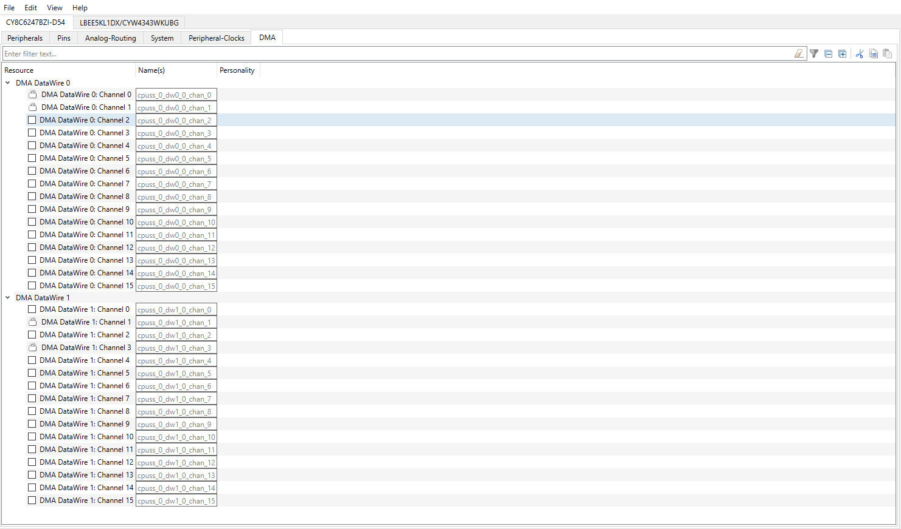

# PSoC&trade; 6 MCU: Power measurements

This code example shows how to achieve the power measurements listed in the PSoC&trade; 6 MCU datasheets.

You can select the desired system configuration (*Spec ID#*) from the device datasheet and configure it using a #define in firmware. The example will configure the PSoC&trade; 6 MCU to run the clock frequencies and system modes for the specified *Spec ID*.

After building and programming the application into the PSoC&trade; 6 MCU, you can measure the current of PSoC&trade; 6 MCU core consumes and compares it against the values specified in the datasheet.

The code example uses both the CM4 and CM0+ cores of the PSoC&trade; 6 MCU to configure the system to achieve power numbers according to the device datasheets.

[View this README on GitHub.](https://github.com/Infineon/mtb-example-psoc6-power-measurements)

[Provide feedback on this code example.](https://cypress.co1.qualtrics.com/jfe/form/SV_1NTns53sK2yiljn?Q_EED=eyJVbmlxdWUgRG9jIElkIjoiQ0UyMzcyNzciLCJTcGVjIE51bWJlciI6IjAwMi0zNzI3NyIsIkRvYyBUaXRsZSI6IlBTb0MmdHJhZGU7IDYgTUNVOiBQb3dlciBtZWFzdXJlbWVudHMiLCJyaWQiOiJ5ZWt0IiwiRG9jIHZlcnNpb24iOiIxLjAuMCIsIkRvYyBMYW5ndWFnZSI6IkVuZ2xpc2giLCJEb2MgRGl2aXNpb24iOiJNQ0QiLCJEb2MgQlUiOiJJQ1ciLCJEb2MgRmFtaWx5IjoiUFNPQyJ9)

## Requirements

- [ModusToolbox&trade; software](https://www.infineon.com/modustoolbox) v3.0 or later (tested with v3.0)
- Board support package (BSP) minimum required version: 4.0.0
- Programming language: C
- Associated parts: All [PSoC&trade; 6 MCU](https://www.infineon.com/cms/en/product/microcontroller/32-bit-psoc-arm-cortex-microcontroller/psoc-6-32-bit-arm-cortex-m4-mcu) parts


## Supported toolchains (make variable 'TOOLCHAIN')

- GNU Arm® embedded compiler v10.3.1 (`GCC_ARM`) - Default value of `TOOLCHAIN`

## Supported kits (make variable 'TARGET')

- [PSoC&trade; 6 Wi-Fi Bluetooth&reg; Pioneer Kit](https://www.infineon.com/CY8CKIT-062-WIFI-BT) (`CY8CKIT-062-WIFI-BT`) – Default value of `TARGET`


## Hardware setup

This example uses the board's default configuration. See the kit user guide to ensure that the board is configured correctly.

**Note:** The PSoC&trade; 6 Bluetooth&reg; LE pioneer kit (CY8CKIT-062-BLE) and the PSoC&trade; 6 Wi-Fi Bluetooth&reg; pioneer kit (CY8CKIT-062-WIFI-BT) ship with KitProg2 installed. The ModusToolbox&trade; software requires KitProg3. Before using this code example, make sure that the board is upgraded to KitProg3. The tool and instructions are available in the [Firmware Loader](https://github.com/Infineon/Firmware-loader) GitHub repository. If you do not upgrade, you will see an error like "unable to find CMSIS-DAP device" or "KitProg firmware is out of date".


## Software setup

This example requires no additional software or tools.


## Using the code example

Create the project and open it using one of the following:

<details><summary><b>In Eclipse IDE for ModusToolbox&trade; software</b></summary>

1. Click the **New Application** link in the **Quick Panel** (or, use **File** > **New** > **ModusToolbox&trade; Application**). This launches the [Project Creator](https://www.infineon.com/ModusToolboxProjectCreator) tool.

2. Pick a kit supported by the code example from the list shown in the **Project Creator - Choose Board Support Package (BSP)** dialog.

   When you select a supported kit, the example is reconfigured automatically to work with the kit. To work with a different supported kit later, use the [Library Manager](https://www.infineon.com/ModusToolboxLibraryManager) to choose the BSP for the supported kit. You can use the Library Manager to select or update the BSP and firmware libraries used in this application. To access the Library Manager, click the link from the **Quick Panel**.

   You can also just start the application creation process again and select a different kit.

   If you want to use the application for a kit not listed here, you may need to update the source files. If the kit does not have the required resources, the application may not work.

3. In the **Project Creator - Select Application** dialog, choose the example by enabling the checkbox.

4. (Optional) Change the suggested **New Application Name**.

5. The **Application(s) Root Path** defaults to the Eclipse workspace which is usually the desired location for the application. If you want to store the application in a different location, you can change the *Application(s) Root Path* value. Applications that share libraries should be in the same root path.

6. Click **Create** to complete the application creation process.

For more details, see the [Eclipse IDE for ModusToolbox&trade; software user guide](https://www.infineon.com/MTBEclipseIDEUserGuide) (locally available at *{ModusToolbox&trade; software install directory}/docs_{version}/mt_ide_user_guide.pdf*).

</details>

<details><summary><b>In command-line interface (CLI)</b></summary>

ModusToolbox&trade; software provides the Project Creator as both a GUI tool and the command line tool, "project-creator-cli". The CLI tool can be used to create applications from a CLI terminal or from within batch files or shell scripts. This tool is available in the *{ModusToolbox&trade; software install directory}/tools_{version}/project-creator/* directory.

Use a CLI terminal to invoke the "project-creator-cli" tool. On Windows, use the command line "modus-shell" program provided in the ModusToolbox&trade; software installation instead of a standard Windows command-line application. This shell provides access to all ModusToolbox&trade; software tools. You can access it by typing `modus-shell` in the search box in the Windows menu. In Linux and macOS, you can use any terminal application.

The "project-creator-cli" tool has the following arguments:

Argument | Description | Required/optional
---------|-------------|-----------
`--board-id` | Defined in the `<id>` field of the [BSP](https://github.com/Infineon?q=bsp-manifest&type=&language=&sort=) manifest | Required
`--app-id`   | Defined in the `<id>` field of the [CE](https://github.com/Infineon?q=ce-manifest&type=&language=&sort=) manifest | Required
`--target-dir`| Specify the directory in which the application is to be created if you prefer not to use the default current working directory | Optional
`--user-app-name`| Specify the name of the application if you prefer to have a name other than the example's default name | Optional

<br>

The following example clones the "[mtb-example-psoc6-power-measurements](https://github.com/Infineon/mtb-example-psoc6-power-measurements)" application with the desired name "PSoC6_PowerMeasurements" configured for the *CY8CKIT-062-WIFI-BT* BSP into the specified working directory, *C:/mtb_projects*:

   ```
   project-creator-cli --board-id CY8CKIT-062-WIFI-BT --app-id mtb-example-psoc6-power-measurements --user-app-name PSoC6_PowerMeasurements --target-dir "C:/mtb_projects"
   ```

**Note:** The project-creator-cli tool uses the `git clone` commands to fetch the repository. For details, see the "Project creator tools" section of the [ModusToolbox&trade; software user guide](https://www.infineon.com/ModusToolboxUserGuide) (locally available at *{ModusToolbox&trade; software install directory}/docs_{version}/mtb_user_guide.pdf*).

To work with a different supported kit later, use the [Library Manager](https://www.infineon.com/ModusToolboxLibraryManager) to choose the BSP for the supported kit. You can invoke the Library Manager GUI tool from the terminal using `make library-manager` command or use the Library Manager CLI tool "library-manager-cli" to change the BSP.

The "library-manager-cli" tool has the following arguments:

Argument | Description | Required/optional
---------|-------------|-----------
`--add-bsp-name` | Name of the BSP that should be added to the application | Required
`--set-active-bsp` | Name of the BSP that should be as active BSP for the application | Required
`--add-bsp-version`| Specify the version of the BSP that should be added to the application if you do not wish to use the latest from manifest | Optional
`--add-bsp-location`| Specify the location of the BSP (local/shared) if you prefer to add the BSP in a shared path | Optional

<br>

Following example adds the CY8CKIT-062-WIFI-BT BSP to the already created application and makes it the active BSP for the app:

   ```
   library-manager-cli --project "C:/mtb_projects/PSoC6_PowerMeasurements" --add-bsp-name CY8CKIT-062-WIFI-BT --add-bsp-version "latest-v4.X" --add-bsp-location "local"

   library-manager-cli --project "C:/mtb_projects/PSoC6_PowerMeasurements" --set-active-bsp APP_CY8CKIT-062-WIFI-BT
   ```

</details>

<details><summary><b>In third-party IDEs</b></summary>

Use one of the following options:

- **Use the standalone [Project Creator](https://www.infineon.com/ModusToolboxProjectCreator) tool:**

   1. Launch Project Creator from the Windows Start menu or from *{ModusToolbox&trade; software install directory}/tools_{version}/project-creator/project-creator.exe*.

   2. In the initial **Choose Board Support Package** screen, select the BSP, and click **Next**.

   3. In the **Select Application** screen, select the appropriate IDE from the **Target IDE** drop-down menu.

   4. Click **Create** and follow the instructions printed in the bottom pane to import or open the exported project in the respective IDE.

<br>

- **Use command-line interface (CLI):**

   1. Follow the instructions from the **In command-line interface (CLI)** section to create the application.

   2. Export the application to a supported IDE using the `make <ide>` command.

   3. Follow the instructions displayed in the terminal to create or import the application as an IDE project.

For a list of supported IDEs and more details, see the "Exporting to IDEs" section of the [ModusToolbox&trade; software user guide](https://www.infineon.com/ModusToolboxUserGuide) (locally available at *{ModusToolbox&trade; software install directory}/docs_{version}/mtb_user_guide.pdf*).

</details>

## Operation

1. Specify the required system configuration in the *shared/include/specs.h* file by modifying the following macros.

   - Configure the `SPEC_ID` macro to be one of the specification IDs (*Spec ID#*) listed in the PSoC&trade; 6 MCU datasheet. The same header file also lists all the supported specification IDs.

     If you want to specify your system settings for the PSoC&trade; 6 MCU instead of the datasheet specification, set the `SPEC_ID` macro to `CUSTOM`, and define your custom settings in the same file by defining the appropriate macros below the line `#if (SPEC_ID == CUSTOM)`. See **Table 1** for these configuration macros.

   - Define the `VCCD_SUPPLY` macro to either `BUCK` or `LDO` based on the desired VCCD supply source.

   For example, if you want to measure the Deep Sleep current of the PSoC&trade; 6 MCU with internal buck enabled and 256-KB SRAM retention as highlighted in **Figure 1**, use the following configurations.

   ```
   #define SPEC_ID         (SIDDS2)
   #define VCCD_SUPPLY     (BUCK)
   ```

   **Figure 1. Example of a Spec ID from CY8C62x6 and CY8C62x7 datasheets**

   

2. Connect the board to your PC using the provided USB cable through the KitProg3 USB connector.

3. Build the code and program the board using one of the following:

   <details><summary><b>Using Eclipse IDE for ModusToolbox</b></summary>

      1. Select the application project in the Project Explorer.

      2. In the **Quick Panel**, scroll down, and click **\<Application Name> Program (KitProg3_MiniProg4)**.
      </details>

   <details><summary><b>Using CLI</b></summary>

     From the terminal, execute the `make program` command to build and program the application using the default toolchain to the default target. You can specify a target and toolchain manually:
      ```
      make program TARGET=<BSP> TOOLCHAIN=<toolchain>
      ```

      Example:
      ```
      make program TARGET=CY8CKIT-062-WIFI-BT TOOLCHAIN=GCC_ARM
      ```
</details>

4. Change the PSoC&trade; 6 MCU voltage supply depending on the desired system configuration. For most of the *Spec IDs*, the device datasheet specifies the current consumption for both 3.3 V and 1.8 V operations. Based on which supply voltage you need, change the jumper/switch setting as shown in **Table 3**. See the kit’s user guide for more details. You must unplug the power to the kit before changing the voltage supply.

5. After programming, the application starts automatically. Measure the current for your kit using an ammeter as instructed in the [Making Current measurements](#making-current-measurements-for-psoc-6-mcu-device) section.

   Compare the observed current numbers against the values specified in the datasheet and confirm that the current is below the maximum current. Note that some of the components from the kit attached to the PSoC&trade; 6 can cause some current leakage, increasing the overall current consumption and exceeding the maximum specification. This is more apparent when the PSoC&trade; is in System Deep Sleep and Hibernate modes.

## Debugging

You can debug the example to step through the code. In the IDE, use the **\<Application Name> Debug (KitProg3_MiniProg4)** configuration in the **Quick Panel**. For details, see the "Program and debug" section in the [Eclipse IDE for ModusToolbox&trade; software user guide](https://www.infineon.com/MTBEclipseIDEUserGuide).

**Note:** **(Only while debugging)** On the CM4 CPU, some code in `main()` may execute before the debugger halts at the beginning of `main()`. This means that some code executes twice – once before the debugger stops execution, and again after the debugger resets the program counter to the beginning of `main()`. See [KBA231071](https://community.infineon.com/docs/DOC-21143) to learn about this and for the workaround.

## Design and implementation

This section guides how to set up the design.modus for adding new BSPs using ModusToolbox&trade; software.

1. Launch the Device configurator tool from the Quick Panel of the IDE. This opens the design.modus file located in <application_folder>/bsps/TARGET_<BSP_NAME>/config/design.modus.

2. Disable all the peripherals on the Peripherals tab as shown in **Figure 2**. 

**Figure 2. Peripheral configuration**


3. Disable all the pins except the default pins on the Pins tab as shown in **Figure 3**.   

**Figure 3. Pin configuration**


4. **Figure 4** shows the Analog-Routing tab.

**Figure 4. Analog-Routing configuration**


5. Disable the debug parameters; ECO, EXTCLK, PILO, WCO, FLL, and PLL on the System tab as shown in **Figure 5**. Set the high clock frequency path as CLK_PATH0 and sourced by IMO and other clocks according to Figure 5.

   Disable the **Run In Hibernate Mode** option under ILO-Parameters. In Hibernate mode, disable all the clocks.

**Figure 5. Clock configuration**


6.  Disable all the parameters on the Peripheral-Clocks tab as shown in Figure 6.

**Figure 6. Peripheral-Clocks configuration**


7. Disable all the DMA parameters on the DMA tab as shown in Figure 7. 

**Figure 7. DMA configuration**



8. Disable the BT Coex, BT, and Wi-Fi parameters as shown in Figure 8.

**Figure 8. Bluetooth&reg;/Wi-Fi configuration**


### Makefiles

The Makefiles for CM0+ and CM4 set the variable `LINKER_SCRIPT` to point to a custom linker script, based on the `TOOLCHAIN` and `TARGET`.

The CM0+ Makefile adds to the variable `DEFINES` the definition of `CY_CORTEX_M4_APPL_ADDR`, which is the CM4 application start address. This address must be manually set based on the location of the CM4 application. The CM0+ application uses this address to launch the CM4 application through the `Cy_SysEnableCM4()` function.

**Note:**   For SRAM retention, configure the linker script as follows.
For 64KB SRAM retention, the RAM size is 32kB(0x8000) for CM0P, and the RAM size is 32kB(0x8000) for CM4.
For 256KB SRAM retention, the RAM size is 128kB(0x20000) for CM0P, and the RAM size is 128kB(0x20000) for CM4.

Adjust the RAM size between the two cores, but of both the core ram size should be 64KB or 256KB according to the SRAM retention.

Set the flash size according to your application size of CM0P and CM4 cores.

### Code example overview

PSoC&trade; 6 MCU datasheets contain the device level-specification tables, which list several possible configurations of CPU clock frequencies, system power modes, cache support, VCCD supply type, and device voltage supply. Each configuration is linked to a specification ID (*Spec ID*). This code example stores details of each specification ID, so you can simply choose the desired configuration by setting the `SPEC_ID` macro in the *shared/include/specs.h* file. You can also set the `SPEC_ID` macro to `CUSTOM` to configure a custom system and power configuration for the PSoC&trade; 6 MCU. These configuration parameters can be specified by a set of macros (in the *specs.h* file) as described in **Table 1**.

**Table 1. Configuration options for custom system and power setting**

 Configuration macro   | Possible options  | Description
 :-------------------- | ------------------------------------ | ---------------------
 System Mode           | `SYSTEM_LP` <br> (OR) <br> `SYSTEM_ULP`  | Defines the system mode the firmware enters – System Low Power or System Ultra-Low Power modes.
Cache Support | `RUN_FROM_FLASH` <br> (OR) <br> `RUN_FROM_CACHE` | Defines RUN_FROM_CACHE if the cache is used.
 CM4 CPU Mode | `CM4_WHILE_LOOP`,<br> `CM4_DHRYSTONE`,<br> `CM4_SLEEP`, (OR) `CM4_DEEP_SLEEP` | Defines what the CM4 CPU runs – While (1) loop, Dhrystone algorithm, go to CPU Sleep, or go to CPU Deep Sleep.
 CM4 CPU Frequency <br> [`CM4_FREQ_MHZ`] | `FREQ_8_MHZ`, <br> `FREQ_25_MHZ`, <br> `FREQ_50_MHZ`,<br> `FREQ_100_MHZ`, (OR) `FREQ_150_MHZ` | Defines the clock frequency for the HFCLK0, which is linked to the CM4 CPU clock.
 CM0+ CPU Mode | `CM0P_WHILE_LOOP`,<br> `CM0P_DHRYSTONE`,<br> `CM0P_SLEEP`,<br> `CM0P_HIBERNATE`, (OR) `CM0P_DEEP_SLEEP` | Defines what the CM0+ CPU runs – While (1) loop, Dhrystone algorithm, go to CPU Sleep, go to hibernate mode, or go to CPU Deep Sleep.
 CM0+ CPU Frequency <br> [`CM0P_FREQ_MHZ`] | `FREQ_8_MHZ`, <br> `FREQ_25_MHZ`, <br> `FREQ_50_MHZ`, <br> `FREQ_75_MHZ`, (OR) `FREQ_100_MHZ` | Defines the clock frequency for the CM0+ CPU clock.
 HF Clock Source <br>[`HF_CLK_SOURCE`] | `IMO`, <br> `FLL`, (OR) `PLL` | Defines the clock source for the HCLK0 – IMO, FLL, or PLL. If IMO is used, the FLL and PLL are bypassed. If the FLL is used, the IMO is still used as the source for the FLL and PLL is disabled. Similarly, if PLL is used, the FLL is disabled and IMO is used as a clock source.
 Minimum Regulator | `MIN_CURRENT` | Defining this macro would set the system into minimum core regulator current mode. This mode limits the maximum current available for the system core logic.
 SRAM Retention <br>[`NO_OF_PAGES`] | `if NO_OF_PAGES = 2, 64KB SRAM retention` (OR) `if NO_OF_PAGES = 8, 256KB SRAM retention` | NO_OF_PAGES : Number of pages should be kept. Determines what size of SRAM needs to be retained (64 KB or 256 KB). The firmware will disable the remaining RAM blocks and RAM controller if applicable.

<br>

For all System LP configurations, there are benchmarks for the BUCK and LDO as the core power supply - `VCCD_SUPPLY` macro sets which type of regulator to use. Note that all the System ULP configurations use only the BUCK. See the System Power Management (SysPm) PDL documentation for more information about the System LP and ULP modes and BUCK and LDO Core voltage regulators.

For all System LP and ULP configurations, there are benchmarks for 3.3 V and 1.8 V device power supplies. There is no option in the firmware to set the power supply voltage. You should manually set the voltage in the kit’s hardware. See **Table 3** for details on the jumper/switch settings to switch between 3.3 V and 1.8 V operation on your kit.

Note that the compiler optimization level will be set to None to achieve the current measurements listed in the datasheet.

### Code example implementation

The code example is implemented as a dual CPU project using both the CM0+ and CM4 cores of the PSoC&trade; 6 MCU. The configurations required to achieve datasheet power numbers are present in the form of macros in *shared/include/specs.h* which is shared by both cores. The shared folder contains other files that are shared between the PSoC&trade; 6 cores - Dhrystone code which is required for a few of the Spec IDs.

The CM0+ core boots up first and sets up the system according to the configuration in *specs.h* file. In CM0+ core, that performs a one-time configuration of the system clock, core regulator, and system power modes (system settings).

After the initial system settings are configured, the CM0+ core enables CM4 depending on the SpecID. CM0+ also disables SRAM blocks according to the SpecID configuration. When enabled, the CM4 core simply runs one of these operations on a loop based on the configuration - while(1) loop, the Dhrystone algorithm, goes to CPU Sleep, or goes to CPU Deep Sleep mode.

 Therefore, CM0+ performs one of these operations on loop based on the configuration - while(1) loop, the Dhrystone algorithm, goes to CPU Sleep, goes to Hibernate mode, or goes to CPU Deep Sleep mode.


## Folder structure

This application has a different folder structure from regular PSoC&trade; 6 examples because it contains the firmware for CM4 and CM0+ (dual core) applications as shown below:

    |-- proj_cm0p/           # CM0+ application folder
        |-- main.c
        |-- Makefile
        |-- README.md            
    |-- proj_cm4/            # CM4 application folder
        |-- main.c
        |-- Makefile
        |-- README.md            
    |-- shared/              # Shared folder for CM0+ and CM4
        |-- include/         # Contains header files for the Dhrystone and specification configuration
        |-- source/          # Contains source code implementing the Dhrystone algorithm
    |-- templates/    
      |--TARGET_CY8CKIT-062-WIFI-BT
       |--COMPONENT_CM0P     # Contains CM0P custom linker scripts for the ARM/GCC_ARM/IAR toolchains
       |--COMPONENT_CM4      # Contains CM4 custom linker scripts for the ARM/GCC_ARM/IAR toolchains
       |--config /           # Contains custom BSP


### Making current measurements for PSoC&trade; 6 MCU device

- **CY8CKIT_062_WIFI_BT**

   Measure the current by connecting an ammeter to the PWR MON jumper J8.
  
**Note:** Remove the R86 resistor, which causes a leakage of 4 µA on the VBACKUP domain that is connected to VTARG.

## Operation at a 1.8 V power supply voltage

Do the following to work at a custom power supply, such as 1.8 V:

1. Launch the **Device configurator** tool from the quick panel of the IDE. This opens the design.modus file located in *\<application_folder>/templates/TARGET_\<BSP-NAME>/config/design.modus*.

2. Update the Operating Conditions as shown in **Figure 9** and select **File** > **Save**.

**Figure 9. Power setting to work with 1.8 V**

   

4. Change the jumper/switch setting as listed in **Table 3**.

 **Table 3. Jumper/switch position for 1.8 V operation**

 Kit                   | Jumper/switch position
 :-------------------- |----------------------
 CY8CKIT-062-WiFi-BT   | SW5 (1-2)

<br>


### Resources and settings

**Table 4. CM0P core resources**

 Resource  |      Purpose
 :------- | :------------
 SYSPM (HAL)| System power management
 CLOCK_SETTINGS (HAL)| System clock settings
 ALL OTHER DRIVERS (PDL) | For switching between regulators (BUCK and LDO), adding cache support, switching power modes (ULP and LP), and enabling CM4 core

<br>

**Table 5. CM4 core resources**

 Resource  |     Purpose
 :------- |  :------------
 SYSPM (HAL)| System power management

<br>

## Related resources


Resources  | Links
-----------|----------------------------------
Application notes  | [AN228571](https://www.infineon.com/AN228571) – Getting started with PSoC&trade; 6 MCU on ModusToolbox&trade; software <br>  [AN215656](https://www.infineon.com/AN215656) – PSoC&trade; 6 MCU: Dual-CPU system design
Code examples  | [Using ModusToolbox&trade; software](https://github.com/Infineon/Code-Examples-for-ModusToolbox-Software) on GitHub
Device documentation | [PSoC&trade; 6 MCU datasheets](https://documentation.infineon.com/html/psoc6/bnm1651211483724.html) 
Development kits | Select your kits from the [evaluation board finder](https://www.infineon.com/cms/en/design-support/finder-selection-tools/product-finder/evaluation-board)
Libraries on GitHub  | [mtb-pdl-cat1](https://github.com/Infineon/mtb-pdl-cat1) – PSoC&trade; 6 Peripheral Driver Library (PDL)  <br> [mtb-hal-cat1](https://github.com/Infineon/mtb-hal-cat1) – Hardware Abstraction Layer (HAL) library <br> [retarget-io](https://github.com/Infineon/retarget-io) – Utility library to retarget STDIO messages to a UART port
Middleware on GitHub  | [psoc6-middleware](https://github.com/Infineon/modustoolbox-software#psoc-6-middleware-libraries) – Links to all PSoC&trade; 6 MCU middleware
Tools  | [Eclipse IDE for ModusToolbox&trade; software](https://www.infineon.com/modustoolbox) – ModusToolbox&trade; software is a collection of easy-to-use software and tools enabling rapid development with Infineon MCUs, covering applications from embedded sense and control to wireless and cloud-connected systems using AIROC&trade; Wi-Fi and Bluetooth&reg; connectivity devices.

<br>

## Other resources

Infineon provides a wealth of data at www.infineon.com to help you select the right device, and quickly and effectively integrate it into your design.

For PSoC&trade; 6 MCU devices, see [How to design with PSoC&trade; 6 MCU - KBA223067](https://community.infineon.com/docs/DOC-14644) in the Infineon Developer community.


## Document history

Document title: *CE237277* - *PSoC&trade; 6 MCU: Power measurements*

 Version | Description of change
 ------- | ---------------------
 1.0.0   | New code example

<br>

---------------------------------------------------------

© Cypress Semiconductor Corporation, 2023. This document is the property of Cypress Semiconductor Corporation, an Infineon Technologies company, and its affiliates ("Cypress").  This document, including any software or firmware included or referenced in this document ("Software"), is owned by Cypress under the intellectual property laws and treaties of the United States and other countries worldwide.  Cypress reserves all rights under such laws and treaties and does not, except as specifically stated in this paragraph, grant any license under its patents, copyrights, trademarks, or other intellectual property rights.  If the Software is not accompanied by a license agreement and you do not otherwise have a written agreement with Cypress governing the use of the Software, then Cypress hereby grants you a personal, non-exclusive, nontransferable license (without the right to sublicense) (1) under its copyright rights in the Software (a) for Software provided in source code form, to modify and reproduce the Software solely for use with Cypress hardware products, only internally within your organization, and (b) to distribute the Software in binary code form externally to end users (either directly or indirectly through resellers and distributors), solely for use on Cypress hardware product units, and (2) under those claims of Cypress’s patents that are infringed by the Software (as provided by Cypress, unmodified) to make, use, distribute, and import the Software solely for use with Cypress hardware products.  Any other use, reproduction, modification, translation, or compilation of the Software is prohibited.
<br>
TO THE EXTENT PERMITTED BY APPLICABLE LAW, CYPRESS MAKES NO WARRANTY OF ANY KIND, EXPRESS OR IMPLIED, WITH REGARD TO THIS DOCUMENT OR ANY SOFTWARE OR ACCOMPANYING HARDWARE, INCLUDING, BUT NOT LIMITED TO, THE IMPLIED WARRANTIES OF MERCHANTABILITY AND FITNESS FOR A PARTICULAR PURPOSE.  No computing device can be absolutely secure.  Therefore, despite security measures implemented in Cypress hardware or software products, Cypress shall have no liability arising out of any security breach, such as unauthorized access to or use of a Cypress product. CYPRESS DOES NOT REPRESENT, WARRANT, OR GUARANTEE THAT CYPRESS PRODUCTS, OR SYSTEMS CREATED USING CYPRESS PRODUCTS, WILL BE FREE FROM CORRUPTION, ATTACK, VIRUSES, INTERFERENCE, HACKING, DATA LOSS OR THEFT, OR OTHER SECURITY INTRUSION (collectively, "Security Breach").  Cypress disclaims any liability relating to any Security Breach, and you shall and hereby do release Cypress from any claim, damage, or other liability arising from any Security Breach.  In addition, the products described in these materials may contain design defects or errors known as errata which may cause the product to deviate from published specifications. To the extent permitted by applicable law, Cypress reserves the right to make changes to this document without further notice. Cypress does not assume any liability arising out of the application or use of any product or circuit described in this document. Any information provided in this document, including any sample design information or programming code, is provided only for reference purposes.  It is the responsibility of the user of this document to properly design, program, and test the functionality and safety of any application made of this information and any resulting product.  "High-Risk Device" means any device or system whose failure could cause personal injury, death, or property damage.  Examples of High-Risk Devices are weapons, nuclear installations, surgical implants, and other medical devices.  "Critical Component" means any component of a High-Risk Device whose failure to perform can be reasonably expected to cause, directly or indirectly, the failure of the High-Risk Device, or to affect its safety or effectiveness.  Cypress is not liable, in whole or in part, and you shall and hereby do release Cypress from any claim, damage, or other liability arising from any use of a Cypress product as a Critical Component in a High-Risk Device. You shall indemnify and hold Cypress, including its affiliates, and its directors, officers, employees, agents, distributors, and assigns harmless from and against all claims, costs, damages, and expenses, arising out of any claim, including claims for product liability, personal injury or death, or property damage arising from any use of a Cypress product as a Critical Component in a High-Risk Device. Cypress products are not intended or authorized for use as a Critical Component in any High-Risk Device except to the limited extent that (i) Cypress’s published data sheet for the product explicitly states Cypress has qualified the product for use in a specific High-Risk Device, or (ii) Cypress has given you advance written authorization to use the product as a Critical Component in the specific High-Risk Device and you have signed a separate indemnification agreement.
<br>
Cypress, the Cypress logo, and combinations thereof, WICED, ModusToolbox, PSoC, CapSense, EZ-USB, F-RAM, and Traveo are trademarks or registered trademarks of Cypress or a subsidiary of Cypress in the United States or in other countries. For a more complete list of Cypress trademarks, visit www.infineon.com. Other names and brands may be claimed as property of their respective owners.
